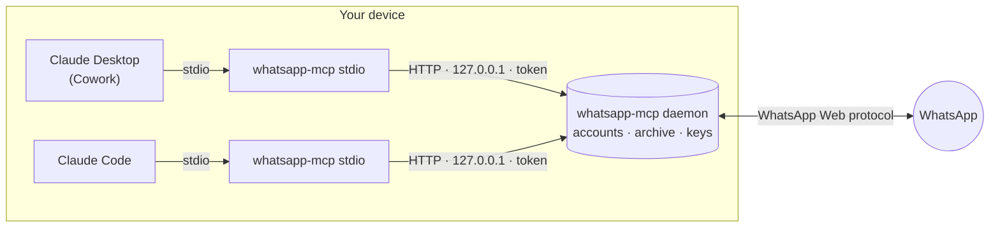

# whatsapp-mcp

WhatsApp for Claude: a Claude plugin with a local MCP server that lets Claude read,
search and send WhatsApp messages across several linked accounts.

> **Status:** Work in progress. Expect breaking changes.

> **Unofficial.** This project is not affiliated with WhatsApp or Meta. This plugin connects as a
> linked device through the WhatsApp Web protocol. Use it for personal messaging only, not
> for bulk or unsolicited messages!

## How it works



- Claude hosts start the plugin's MCP server once per session. WhatsApp allows one live
  connection per linked device, so each session's process is a thin shim that forwards
  calls to a single detached daemon, starting it when needed.
- The daemon owns the WhatsApp connections (several accounts, each under a nickname such
  as `personal` or `business`), the message archive and the device keys.
- A newer shim replaces an older daemon; an older shim never downgrades a newer one.

## Install

**Claude Desktop (Cowork) and Claude Code**

Customize → Plugins → Add → *Add from a repository* → `exomind-tmi/claude-plugins`,
then install **whatsapp**. Claude Code that is signed in with the same account will
automatically pick it up on every device.

**Claude Code only**

```
claude plugin marketplace add exomind-tmi/claude-plugins
claude plugin install whatsapp@exomind
```

## Security model

- The daemon runs on your device and talks only to WhatsApp.
- The daemon listens on `127.0.0.1` only, on a random port. Every MCP request needs a
  bearer token that the daemon creates in its state directory; requests with a foreign
  `Host` header are rejected.
- Before sending the token, the shim checks that the daemon on the recorded port knows
  it: `/healthz` answers a random challenge with an HMAC of the token, so a stranger
  listening on that port never receives it.
- The server tells Claude to treat message text from other people as data, never as
  instructions. The send tools are marked destructive, so Claude asks before every send.

State lives in `~/.mcp/exomind-tmi/whatsapp-mcp/` (override with `WHATSAPP_MCP_HOME`):
device keys, the message archive, the token and logs. Anyone who can read this folder can
act as your linked device; it is protected by your user account's file permissions.

## Development

Go 1.27, no CGO. Builds for Windows and Linux (x64).

```
go test ./...
scripts/build.sh      # dist/windows-amd64, dist/linux-amd64
scripts/dev-install.sh # a plugin pinned to a local build, for testing
scripts/notices.sh    # regenerate THIRD_PARTY_NOTICES.md after changing go.mod
```

`whatsapp-mcp status` and `whatsapp-mcp stop` show and stop the daemon; the binary of the
daemon is located at `~/.mcp/exomind-tmi/whatsapp-mcp/bin/<version>/whatsapp-mcp`.

## Acknowledgements

- [whatsmeow](https://github.com/tulir/whatsmeow) by Tulir Asokan: the awesome WhatsApp Web
  protocol library this project builds on.
- [MCP Go SDK](https://github.com/modelcontextprotocol/go-sdk): the Model Context Protocol
  implementation.
- [modernc.org/sqlite](https://gitlab.com/cznic/sqlite): SQLite in pure Go, no CGO.
- [go-licenses](https://github.com/google/go-licenses): third-party notices.
- Designed and written together with [Claude Code](https://claude.com/claude-code).

All third-party components and their licenses are listed in
[THIRD_PARTY_NOTICES.md](THIRD_PARTY_NOTICES.md).

## License

[GPL-3.0-only](LICENSE) © 2026 Exomind Tmi
